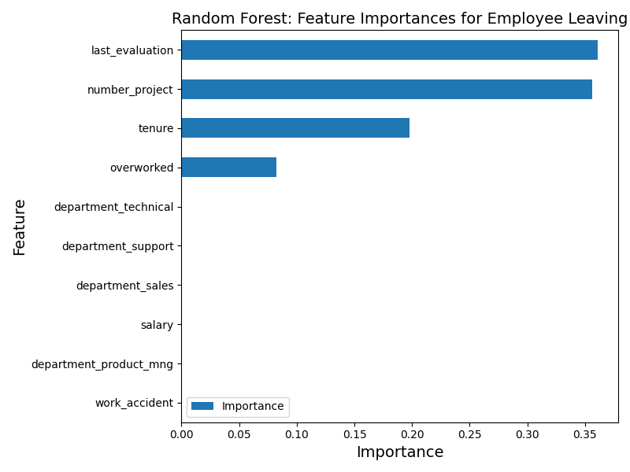

# Salifort Motors Employee Retention Analysis
This repository contains the analysis and predictive model for the Salifort Motors employee retention capstone project. The goal was to understand why employees leave and to provide the company with actionable, data-driven strategies to improve retention.

## Table of Contents
1. [Project Objective](#project-objective)
2. [The Dataset](#the-dataset)
3. [Analysis Process](#analysis-process)
4. [Key Findings from EDA](#key-findings-from-exploratory-data-analysis)
5. [Predictive Model Results](#predictive-model-results)
6. [Actionable Recommendations](#key-predictive-features)
7. [Project Files](#project-files)
8. [Tools and Libraries](#tools-and-libraries)
9. [Contact](#contact)

## Project Objective
The senior leadership at Salifort Motors wanted to understand the answer to a critical question: **What's likely to make an employee leave the company?**

This project aims to answer that question by analyzing employee data to identify the key factors driving attrition and building a model to predict which employees are at the highest risk of leaving.

## The Dataset
The dataset is a CSV file containing 15,000 records and 10 columns of anonymized employee data, sourced from a Kaggle competition. Key features include:

- `satisfaction_level`
- `last_evaluation`
- `number_project`
- `average_montly_hours`
- `time_spend_company` (tenure)
- `left (the target` variable)

## Analysis Process
My approach followed a standard data analysis workflow:

1. **Data Cleaning:** Handled 3,008 duplicate rows, which were removed to ensure data integrity. Outliers in the `tenure` column were identified but kept for the initial analysis to understand their impact.
2. **Exploratory Data Analysis (EDA):** I used visualizations (boxplots, histograms, scatterplots) to explore relationships between variables and identify initial patterns related to employee attrition.
3. **Feature Engineering:** I created a new binary feature called `overworked` for employees working more than 175 hours per month, which proved to be a strong indicator of burnout.
4. **Modeling:** I developed and compared several classification models. A Random Forest Classifier was selected as the final model due to its high accuracy and robust performance.

## Key Findings from Exploratory Data Analysis
- **The Burnout Zone:** A significant group of employees who left were working between 240-315 hours per month and had very low satisfaction levels.
- **Project Overload is Real:** Employees assigned to 7 projects had a 100% attrition rate. The sweet spot for retention appears to be 3-4 projects.
- **The 4-Year Itch:** Employees with 4 and 5 years of tenure have a surprisingly high turnover rate, suggesting a potential issue with mid-career growth and recognition.

## Predictive Model Results
The final Random Forest model performed exceptionally well in identifying employees likely to leave.

| Metric     | Score           |
|------------|-----------------|
| Accuracy   | 96.3%           |
| Precision  | 87.0%           |
| Recall     | 91.2%           |
| F1-score   | 89.0%           |
| AUC        | 94.2%           |

## Key Predictive Features
The model confirmed that the most important factors for predicting attrition are, in order:

1. `last_evaluation`
2. `number_project`
3. `tenure`
3. `overworked` (our engineered feature)

## Actionable Recommendations
Based on these findings, I proposed the following strategies to Salifort's leadership:

1. **Manage Workload:** Cap the number of active projects per employee to 4 and re-evaluate expectations around overtime.
2. **Improve Career Paths:** Investigate why employees with 4-5 years of tenure are leaving and create clearer paths for promotion and growth.
3. **Reform Recognition:** Ensure performance evaluations reward impact and contribution, not just long hours.

## Project Files
- `Salifort Motors project lab.pdf`: A PDF of the complete Jupyter Notebook with all code and analysis.
- `executive-summary.pptx`: A slide deck summarizing the key findings for a business audience.

## Tools and Libraries
- **Python**
- **Pandas & NumPy** for data manipulation.
- **Matplotlib & Seaborn** for data visualization.
- **Scikit-learn** for modeling and evaluation.
